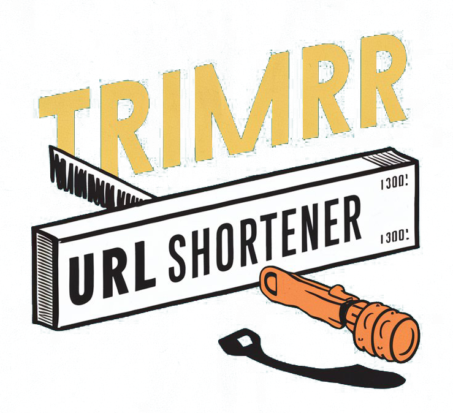

# 📋 URL TRIMR - Project Documentation

<div align="center">
  
  
  ### 🔗 Advanced URL Shortener with Real-time Analytics
  
  **A comprehensive project documentation covering development journey, challenges, and innovations**
</div>

---

## 📌 **Table of Contents**
1. [Problem Statement](#-problem-statement)
2. [Why We Built This](#-why-we-built-this)
3. [Technology Stack](#️-technology-stack)
4. [Challenges Faced](#-challenges-faced)
5. [Unique Features](#-unique-features)
6. [What Makes It Different](#-what-makes-it-different)
7. [Target Audience](#-target-audience)
8. [Technical Architecture](#️-technical-architecture)
9. [Future Scope](#-future-scope)
10. [Lessons Learned](#-lessons-learned)

---

## 🎯 **Problem Statement**

### **The Challenge:**
In today's digital landscape, sharing long, complex URLs is cumbersome and unprofessional. Existing URL shorteners either lack comprehensive analytics, have poor user experience, or charge premium for basic features.

### **Specific Problems Identified:**
- **Lengthy URLs**: Social media character limits and email readability issues
- **Poor Analytics**: Most free services provide minimal tracking data
- **No Customization**: Generic short URLs that don't align with branding
- **Limited Management**: Difficulty organizing and managing multiple shortened URLs
- **Security Concerns**: Lack of transparency about where shortened URLs redirect
- **Mobile Experience**: Many existing solutions aren't mobile-optimized

### **Market Gap:**
- Free services with comprehensive analytics are rare
- Most solutions lack modern, intuitive user interfaces
- Limited integration capabilities with other tools
- Poor geographic and device tracking features

---

## 💡 **Why We Built This**

### **Primary Motivations:**

#### 🚀 **Learning & Skill Development**
- **Full-Stack Experience**: Wanted to build an end-to-end application
- **Modern Tech Stack**: Opportunity to work with React 19, Supabase, and latest tools
- **Real-World Problem**: Solving an actual problem faced by content creators and marketers

#### 📊 **Market Need**
- **Free Alternative**: Provide enterprise-level features without cost barriers
- **Better UX**: Create a more intuitive and visually appealing interface
- **Comprehensive Analytics**: Offer detailed insights that competitors charge for

#### 🎨 **Innovation Focus**
- **Modern Design**: Implement current UI/UX trends and best practices
- **Performance**: Build a fast, responsive application using latest optimization techniques
- **Scalability**: Design architecture that can handle growth and feature expansion

### **Personal Goals:**
- Portfolio enhancement for career growth
- Understanding of database design and real-time analytics
- Experience with modern deployment and DevOps practices
- Building something genuinely useful for the community

---

## 🛠️ **Technology Stack**

### **Frontend Technologies**
| Technology | Version | Purpose | Why Chosen |
|------------|---------|---------|------------|
| **React** | 19.1.0 | UI Framework | Latest features, excellent ecosystem |
| **Vite** | 7.0.4 | Build Tool | Faster development, optimized bundling |
| **TailwindCSS** | 3.4.17 | Styling | Rapid development, consistent design |
| **React Router** | 7.7.0 | Navigation | SPA routing, modern navigation patterns |
| **Radix UI** | Latest | Components | Accessible, unstyled primitives |

### **Backend & Database**
| Technology | Purpose | Benefits |
|------------|---------|----------|
| **Supabase** | Backend-as-a-Service | Real-time features, authentication, PostgreSQL |
| **PostgreSQL** | Database | Reliability, ACID compliance, JSON support |
| **Supabase Auth** | Authentication | Built-in security, social logins |
| **Supabase Realtime** | Live Updates | Real-time analytics updates |

### **Analytics & Utilities**
| Library | Purpose | Implementation |
|---------|---------|----------------|
| **UA Parser** | Device Detection | Browser/OS identification |
| **Recharts** | Data Visualization | Interactive charts and graphs |
| **React QR Code** | QR Generation | Dynamic QR code creation |
| **Yup** | Validation | Form validation schemas |

### **Deployment & DevOps**
| Service | Purpose | Advantages |
|---------|---------|------------|
| **Vercel** | Hosting | Automatic deployments, edge functions |
| **GitHub** | Version Control | Collaboration, CI/CD integration |
| **Vercel Analytics** | Performance | Real user monitoring |

---

## 😰 **Challenges Faced**

### **1. Database Design Complexity**
**Challenge**: Designing efficient schema for URLs, clicks, and user relationships
```sql
-- Initial schema was too normalized, causing performance issues
-- Had to optimize for read-heavy operations
```
**Solution**: 
- Implemented denormalized click tracking for faster analytics
- Added proper indexing for geographic and temporal queries
- Used PostgreSQL JSON fields for flexible metadata storage

### **2. Real-time Analytics Implementation**
**Challenge**: Providing instant analytics updates without overwhelming the database
**Issues Faced**:
- Initial approach caused too many database calls
- Race conditions in click counting
- Memory leaks in real-time subscriptions

**Solution**:
- Implemented debounced updates
- Used Supabase real-time subscriptions efficiently
- Added proper cleanup in React useEffect hooks

### **3. URL Collision Handling**
**Challenge**: Ensuring unique short URLs while maintaining performance
```javascript
// Initial naive approach
const shortUrl = Math.random().toString(36).substring(7);

// Improved collision-resistant approach
const generateShortUrl = async () => {
  let attempts = 0;
  while (attempts < 10) {
    const candidate = generateRandomString();
    const exists = await checkUrlExists(candidate);
    if (!exists) return candidate;
    attempts++;
  }
  throw new Error('Unable to generate unique URL');
};
```

### **4. Mobile Responsiveness**
**Challenge**: Complex analytics charts not rendering properly on mobile
**Issues**:
- Recharts responsiveness problems
- Touch interactions not working
- Performance issues on mobile devices

**Solution**:
- Implemented responsive chart containers
- Added touch-friendly interactions
- Optimized bundle size and lazy loading

### **5. Security Considerations**
**Challenge**: Preventing malicious URL submissions and abuse
**Implementation**:
- URL validation and sanitization
- Rate limiting for URL creation
- Blacklist for known malicious domains
- User authentication requirements for advanced features

### **6. Deployment Issues**
**Challenge**: React Router not working properly on Vercel
**Problem**: 404 errors for direct URL access to shortened links
**Solution**: Added `vercel.json` configuration for SPA routing
```json
{
  "rewrites": [
    {
      "source": "/(.*)",
      "destination": "/index.html"
    }
  ]
}
```

---

## ✨ **Unique Features**

### **1. Comprehensive Analytics Dashboard**
- **Real-time Updates**: Live click tracking and statistics
- **Geographic Insights**: Country and city-level data visualization
- **Device Analytics**: Detailed breakdown of user devices and browsers
- **Time-based Analysis**: Click patterns over different time periods
- **Interactive Charts**: Hover effects, zooming, and filtering capabilities

### **2. Advanced QR Code Generation**
- **Automatic Generation**: QR codes created instantly for every short URL
- **Customizable Design**: Logo integration and styling options
- **High Resolution**: Vector-based QR codes for print quality
- **Batch Generation**: Multiple QR codes for bulk operations

### **3. Custom URL Aliases**
- **Brand-friendly URLs**: Create memorable, branded short links
- **Availability Check**: Real-time validation of custom URL availability
- **Reserved Keywords**: Protection against inappropriate aliases
- **Case-insensitive**: Flexible URL handling

### **4. Smart Link Management**
- **Search & Filter**: Find links by title, URL, or creation date
- **Bulk Operations**: Select and manage multiple links simultaneously
- **Link Analytics**: Individual performance metrics for each URL
- **Export Capabilities**: Download analytics data in various formats

### **5. Modern User Experience**
- **Dark/Light Mode**: Theme switching with system preference detection
- **Responsive Design**: Optimized for all screen sizes and devices
- **Progressive Web App**: Installable with offline capabilities
- **Accessibility**: WCAG 2.1 compliant with keyboard navigation

---

## 🌟 **What Makes It Different**

### **Compared to Bit.ly:**
| Feature | URL TRIMR | Bit.ly |
|---------|-----------|--------|
| **Free Analytics** | ✅ Comprehensive | ❌ Limited |
| **Custom Domains** | 🔄 Planned | 💰 Premium |
| **QR Codes** | ✅ Free | 💰 Premium |
| **Real-time Data** | ✅ Yes | ❌ Delayed |
| **Open Source** | ✅ Yes | ❌ No |

### **Compared to TinyURL:**
| Feature | URL TRIMR | TinyURL |
|---------|-----------|---------|
| **User Dashboard** | ✅ Advanced | ❌ Basic |
| **Analytics** | ✅ Detailed | ❌ None |
| **Modern UI** | ✅ React-based | ❌ Legacy |
| **Mobile App** | 🔄 Planned | ❌ No |
| **API Access** | 🔄 Planned | 💰 Premium |

### **Unique Value Propositions:**

#### 🎯 **For Content Creators**
- Detailed audience insights without cost barriers
- Brand-consistent short URLs for professional appearance
- Easy integration with social media workflows
- Visual analytics for better content strategy

#### 📊 **For Marketers**
- Campaign tracking with geographic breakdown
- Device and browser analytics for targeting
- Click-through rate optimization insights
- Export capabilities for reporting

#### 🎓 **For Developers**
- Open-source codebase for learning and contribution
- Modern tech stack demonstrating best practices
- API-first design for future integrations
- Comprehensive documentation and examples

#### 🏢 **For Small Businesses**
- Professional link management without subscription costs
- Brand building through custom short URLs
- Customer behavior insights for business decisions
- Scalable solution that grows with business needs

---

## 👥 **Target Audience**

### **Primary Audience**

#### 🎨 **Content Creators & Influencers**
**Demographics**: Ages 18-35, social media active
**Needs**:
- Track engagement across platforms
- Professional-looking links for brand consistency
- Understand audience geographic distribution
- Optimize content based on click patterns

**Use Cases**:
- YouTube video descriptions
- Instagram bio links
- Twitter posts with character limits
- Email newsletter links

#### 📈 **Digital Marketers**
**Demographics**: Marketing professionals, agencies
**Needs**:
- Campaign performance tracking
- A/B testing different link strategies
- Client reporting with detailed analytics
- Cost-effective alternative to premium tools

**Use Cases**:
- Email marketing campaigns
- Social media advertising
- Affiliate marketing tracking
- Client presentation materials

#### 🏢 **Small Business Owners**
**Demographics**: Entrepreneurs, local businesses
**Needs**:
- Professional online presence
- Customer behavior insights
- Budget-friendly marketing tools
- Easy-to-use interface

**Use Cases**:
- Business card QR codes
- Social media profiles
- Local advertising campaigns
- Customer feedback collection

### **Secondary Audience**

#### 🎓 **Students & Educators**
**Needs**: Simple link sharing, project presentation, research organization
**Use Cases**: Assignment submissions, resource sharing, online learning

#### 💻 **Developers & Tech Enthusiasts**
**Needs**: Learning from open-source code, contributing to projects
**Use Cases**: Portfolio projects, learning modern tech stack, API experimentation

#### 🌐 **Non-profit Organizations**
**Needs**: Cost-effective tools, donor engagement tracking
**Use Cases**: Fundraising campaigns, volunteer coordination, awareness campaigns

### **Market Size & Opportunity**
- **Global URL Shortener Market**: $1.2B+ (2024)
- **Annual Growth Rate**: 8.5% CAGR
- **Target User Base**: 50M+ potential users globally
- **Primary Markets**: North America, Europe, Asia-Pacific

---

## 🏗️ **Technical Architecture**

### **System Design Overview**
```
┌─────────────────┐    ┌─────────────────┐    ┌─────────────────┐
│   Frontend      │    │   Supabase      │    │   External      │
│   (React SPA)   │◄──►│   Backend       │◄──►│   Services      │
│                 │    │                 │    │                 │
│ • Components    │    │ • PostgreSQL    │    │ • Vercel Edge   │
│ • State Mgmt    │    │ • Auth Service  │    │ • CDN           │
│ • API Calls     │    │ • Real-time     │    │ • Analytics     │
│ • Routing       │    │ • Storage       │    │ • Monitoring    │
└─────────────────┘    └─────────────────┘    └─────────────────┘
```

### **Database Schema**
```sql
-- Core URL storage
CREATE TABLE urls (
    id UUID PRIMARY KEY DEFAULT gen_random_uuid(),
    user_id UUID REFERENCES auth.users(id),
    original_url TEXT NOT NULL,
    short_url VARCHAR(10) UNIQUE NOT NULL,
    custom_url VARCHAR(50) UNIQUE,
    title TEXT,
    qr_code TEXT,
    created_at TIMESTAMP WITH TIME ZONE DEFAULT NOW(),
    expires_at TIMESTAMP WITH TIME ZONE,
    is_active BOOLEAN DEFAULT true
);

-- Click tracking for analytics
CREATE TABLE clicks (
    id UUID PRIMARY KEY DEFAULT gen_random_uuid(),
    url_id UUID REFERENCES urls(id) ON DELETE CASCADE,
    clicked_at TIMESTAMP WITH TIME ZONE DEFAULT NOW(),
    ip_address INET,
    user_agent TEXT,
    referer TEXT,
    country VARCHAR(100),
    city VARCHAR(100),
    device VARCHAR(50),
    browser VARCHAR(50),
    os VARCHAR(50)
);

-- Indexes for performance
CREATE INDEX idx_urls_short_url ON urls(short_url);
CREATE INDEX idx_urls_custom_url ON urls(custom_url);
CREATE INDEX idx_clicks_url_id ON clicks(url_id);
CREATE INDEX idx_clicks_clicked_at ON clicks(clicked_at);
```

### **API Endpoints**
```javascript
// URL Management
POST   /api/urls              // Create short URL
GET    /api/urls              // List user's URLs
GET    /api/urls/:id          // Get specific URL details
PUT    /api/urls/:id          // Update URL
DELETE /api/urls/:id          // Delete URL

// Analytics
GET    /api/urls/:id/analytics // Get URL analytics
GET    /api/analytics/summary  // Get user's overall stats

// Redirect
GET    /:shortUrl             // Redirect to original URL
```

### **Performance Optimizations**
- **Database Indexing**: Strategic indexes for fast lookups
- **Caching**: Redis-like caching for frequently accessed URLs
- **CDN**: Static assets served via Vercel Edge Network
- **Lazy Loading**: Component-level code splitting
- **Image Optimization**: Automatic image compression and format selection

---

## 🚀 **Future Scope**

### **Phase 1: Enhanced Features (Next 3 months)**
- [ ] **Bulk URL Import/Export**: CSV/Excel file processing
- [ ] **Advanced Filtering**: Date ranges, click thresholds, tags
- [ ] **Link Expiration**: Automatic URL deactivation
- [ ] **Password Protection**: Secure access to sensitive links
- [ ] **API Rate Limiting**: Prevent abuse and ensure fair usage

### **Phase 2: Advanced Analytics (3-6 months)**
- [ ] **Heat Maps**: Visual click pattern analysis
- [ ] **A/B Testing**: Multiple destinations for same short URL
- [ ] **Conversion Tracking**: Goal-based analytics
- [ ] **Custom Events**: User-defined tracking points
- [ ] **Webhook Integration**: Real-time notifications

### **Phase 3: Platform Expansion (6-12 months)**
- [ ] **REST API**: Public API for developers
- [ ] **Browser Extension**: Chrome/Firefox/Edge extensions
- [ ] **Mobile Apps**: React Native iOS/Android apps
- [ ] **Custom Domains**: Use your own domain for short URLs
- [ ] **Team Collaboration**: Multi-user accounts and permissions

### **Phase 4: Enterprise Features (12+ months)**
- [ ] **White-label Solution**: Rebrandable for agencies
- [ ] **SSO Integration**: SAML/OAuth enterprise login
- [ ] **Advanced Security**: Malware scanning, content filtering
- [ ] **Compliance**: GDPR, CCPA data protection features
- [ ] **On-premise Deployment**: Self-hosted enterprise version

### **Technology Roadmap**
- **Frontend**: Migration to Next.js for better SEO and performance
- **Backend**: Microservices architecture for scalability
- **Database**: Sharding strategy for handling millions of URLs
- **AI/ML**: Predictive analytics for click forecasting
- **Blockchain**: Decentralized URL verification system

---

## 📚 **Lessons Learned**

### **Technical Learnings**

#### 🔧 **Database Design**
- **Lesson**: "Premature optimization is the root of all evil" - Start simple, optimize based on actual usage
- **Application**: Initial complex normalization caused performance issues; simplified schema improved speed
- **Future Application**: Always profile before optimizing, use analytics to guide design decisions

#### ⚡ **Performance Optimization**
- **Lesson**: Real-time features can be resource-intensive if not implemented carefully
- **Application**: Learned to use debouncing, efficient subscriptions, and proper cleanup
- **Future Application**: Always consider the resource implications of real-time features

#### 🎨 **UI/UX Design**
- **Lesson**: Mobile-first design is crucial, not an afterthought
- **Application**: Redesigned analytics dashboard three times to get mobile experience right
- **Future Application**: Start with mobile constraints, expand to desktop

### **Project Management Learnings**

#### 📋 **Scope Management**
- **Lesson**: Feature creep is real - maintain focus on core functionality first
- **Application**: Initially tried to build too many features simultaneously
- **Future Application**: MVP approach with iterative feature additions

#### 🧪 **Testing Strategy**
- **Lesson**: Manual testing doesn't scale - automated testing saves time in long run
- **Application**: Spent too much time on manual browser testing
- **Future Application**: Implement unit and integration tests from day one

### **Deployment & DevOps**

#### 🚀 **Continuous Deployment**
- **Lesson**: Automated deployments reduce human error and increase confidence
- **Application**: Vercel's auto-deployment from GitHub improved development speed
- **Future Application**: Implement staging environments and proper CI/CD pipelines

#### 📊 **Monitoring & Analytics**
- **Lesson**: You can't improve what you don't measure
- **Application**: Added comprehensive logging and analytics to understand user behavior
- **Future Application**: Implement monitoring from the beginning, not as an afterthought

### **User Experience Insights**

#### 👥 **User Feedback Integration**
- **Lesson**: Regular user feedback is invaluable for product direction
- **Application**: Features like QR code generation came from user requests
- **Future Application**: Build feedback mechanisms into the product itself

#### 🎯 **Feature Prioritization**
- **Lesson**: Users care more about reliability than feature quantity
- **Application**: Focused on making core URL shortening rock-solid before adding analytics
- **Future Application**: Prioritize stability and performance over new features

---

## 📈 **Success Metrics & KPIs**

### **Technical Metrics**
- **Performance**: Average page load time < 2 seconds
- **Reliability**: 99.9% uptime target
- **Scalability**: Handle 1000+ concurrent users
- **Security**: Zero security incidents reported

### **User Engagement Metrics**
- **Active Users**: Monthly active user growth
- **Feature Adoption**: Analytics dashboard usage rate
- **User Retention**: Return user percentage
- **Session Duration**: Average time spent on platform

### **Business Metrics**
- **Cost Efficiency**: Hosting costs per user
- **Growth Rate**: New user acquisition rate
- **Feature Usage**: Most/least used features
- **Support Requests**: User issue resolution time

---

## 🎯 **Conclusion**

URL TRIMR represents more than just a URL shortener - it's a comprehensive link management platform that addresses real market needs while demonstrating modern web development practices. Through this project, we've successfully:

✅ **Solved Real Problems**: Created a free alternative to expensive URL shortening services  
✅ **Demonstrated Technical Skills**: Implemented complex features like real-time analytics and geographic tracking  
✅ **Built for Scale**: Designed architecture that can handle growth and feature expansion  
✅ **Focused on UX**: Created an intuitive, accessible interface that users actually enjoy using  
✅ **Learned and Grew**: Gained valuable experience in full-stack development, database design, and user experience  

The project showcases the power of modern web technologies and the importance of user-centered design. It serves as both a practical tool for users and a comprehensive demonstration of contemporary web development skills.

**Next Steps**: Continue iterating based on user feedback, implement planned features, and explore opportunities for community contribution and collaboration.

---

<div align="center">

**📝 Document Version**: 1.0  
**📅 Last Updated**: July 2025  
**👤 Author**: Sameeksha  
**🔗 Project Repository**: [URL-TRIMR](https://github.com/Sameeksha200416/URL-TRIMR)

---

*This documentation is living document that will be updated as the project evolves and new insights are gained.*

</div>
